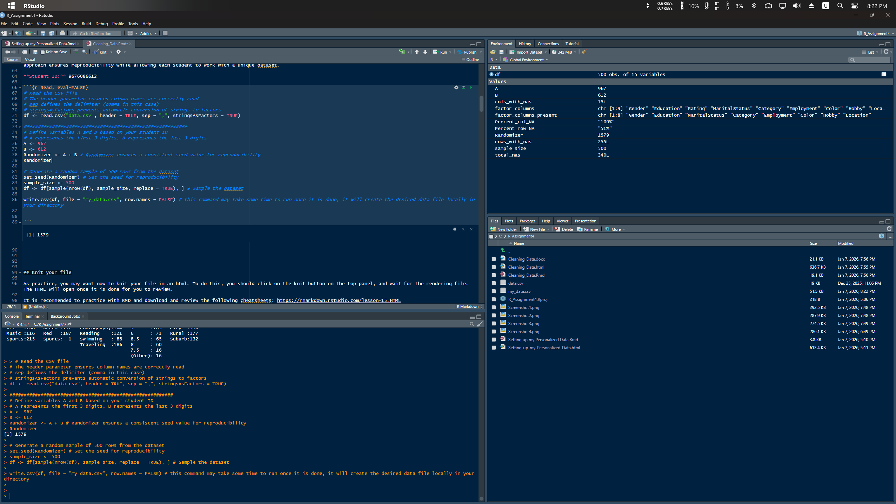
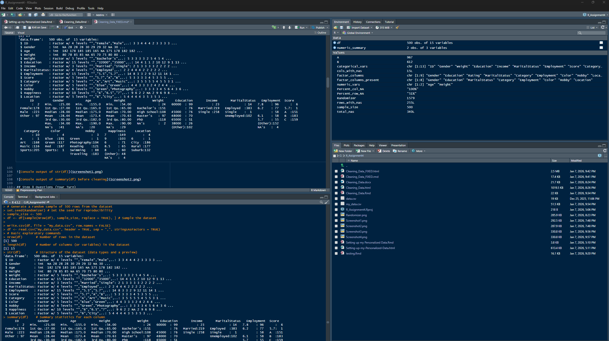
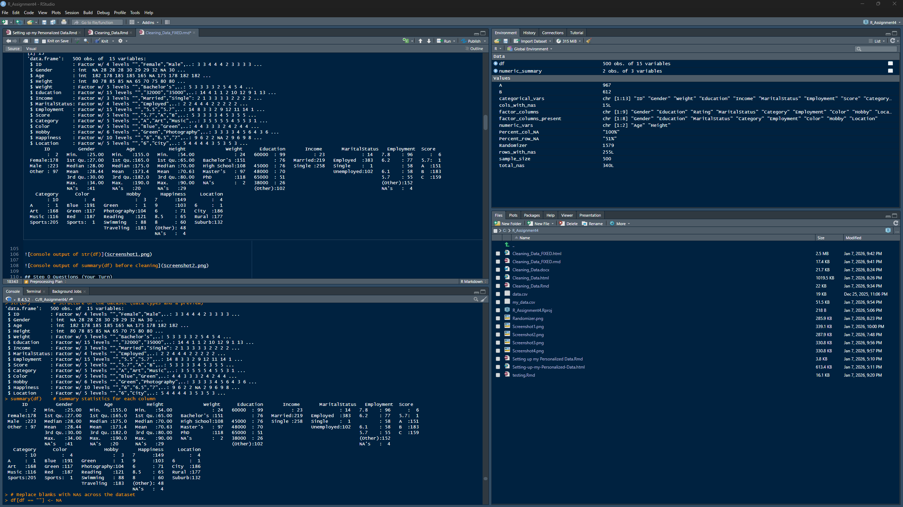
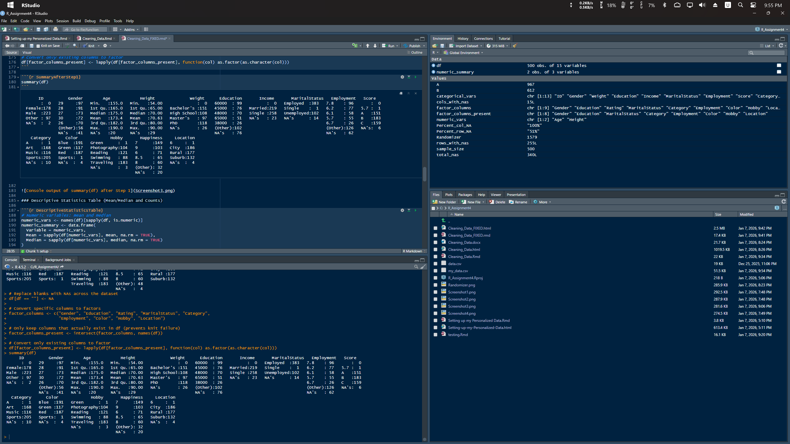

<!-- ========================= -->
<!-- APA-Style Title Page -->
<!-- ========================= -->

<div align="center">

# Cleaning your Data


**Juan Maldonado Franco**  
Department of Technology, National University  
DDS-8500: Principles of Data Science  
Dr. Javier E. León  
Date  

</div>

\newpage

```{r setup, include=FALSE}
knitr::opts_chunk$set(echo = TRUE)
```

## Already complete Code

As we move on from week to week and task to task, the code that you have already completed will stay on the template but will not run; this is possible by adding `eval=FALSE` to the corresponding code chunk. Note that the libraries need to be linked to this program as well.

```{r install}
# Install and load necessary libraries
# install.packages("ggplot2")
# install.packages("scales")
# install.packages("moments")
library(ggplot2)
library(scales)
```

## Setting up your directory in your computer

```{r Dir}
# Check the current working directory
getwd()

# If you are using an RStudio Project, you usually do NOT need setwd().
# setwd("C:/R_Assignment4")  # project sets working directory
```

## 1. Introduction

This assignment was completed using the **R programming language** within the **RStudio integrated development environment (IDE)**. R is widely used for statistical computing and exploratory data analysis due to its strong support for missing data handling and reproducible research workflows (Jakobsen et al., 2022). One of R’s key strengths is its native handling of missing values and its strong support for reproducible research through tools such as R Markdown.

RStudio serves as the graphical user interface (GUI) for this assignment, integrating script editing, console execution, visualization, and document rendering in a single environment. Compared to spreadsheet tools, R provides significantly greater flexibility and scalability for data preprocessing tasks. Compared to Python, R is often preferred for exploratory data analysis and statistical modeling, while Python is more commonly used for general-purpose programming and production systems.

The dataset used in this assignment is a **personalized CSV file (`my_data.csv`)**, generated from the original `data.csv` file using a fixed random seed. This approach ensures reproducibility while allowing each student to work with a unique dataset.

**Student ID:** 9676086612

```{r Read, eval=FALSE}
# Read the CSV file
df <- read.csv("data.csv", header = TRUE, sep = ",", stringsAsFactors = TRUE)

##########################################################
# Define variables A and B based on your student ID
# A represents the first 3 digits, B represents the last 3 digits
A <- 967
B <- 612
Randomizer <- A + B # Randomizer ensures a consistent seed value for reproducibility
Randomizer

# Generate a random sample of 500 rows from the dataset
set.seed(Randomizer) # Set the seed for reproducibility
sample_size <- 500
df <- df[sample(nrow(df), sample_size, replace = TRUE), ] # Sample the dataset

write.csv(df, file = "my_data.csv", row.names = FALSE)
```



## Knit your file (practice note)

As practice, you may want now to knit your file in an HTML. To do this, click on the knit button on the top panel and wait for the rendering file. The HTML will open once it is done.

```{r ReadYourFile}
df <- read.csv("my_data.csv", header = TRUE, sep = ",", stringsAsFactors = TRUE)
```

## 2. Data Presentation before Cleansing

***Step 0. Now that you read the file, you want to learn a few information about your data.***

```{r Explore}
# Basic exploratory commands
nrow(df)       # Number of rows in the dataset
length(df)     # Number of columns (or variables) in the dataset
str(df)        # Structure of the dataset (data types and a preview)
summary(df)    # Summary statistics for each column
```





## Step 0 Questions (Your Turn)

***Question 1***  
**What type of variables does your file include?**

***Answer 1:***  
The dataset includes both quantitative and qualitative variables. Quantitative variables represent numeric measurements such as age, height, and numeric scores, while qualitative variables represent categories such as gender, education level, marital status, employment status, hobbies, colors, and locations.

***Question 2***  
**Specific data types?**

***Answer 2:***  
Most non-numeric fields are read as factors because `stringsAsFactors = TRUE`. The numeric fields are stored as integer or numeric/double types. Integer variables include Age, Height, and Gender (although Gender should be categorical). Most other variables, such as ID, Weight, Education, Income, MaritalStatus, Employment, Score, Category, Color, Hobby, Happiness, and Location, are stored as factor variables (some of these should also be categorical).

***Question 3***  
**Are they read properly?**

***Answer 3:***  
Some variables are read properly; however, several variables that should be numeric (such as Weight, Education, Income, Employment, and Score) are read as factor variables. This indicates that numeric and categorical values are mixed or that the data were stored as text in the original file, which requires preprocessing before analysis.

***Question 4***  
**Are there any issues?**

***Answer 4:***  
Yes, there are several data quality issues. These include variables with incorrect data types, the presence of missing values (NAs), and blank values stored as empty strings. These issues can affect analysis accuracy and must be addressed during the data cleaning and preprocessing stages.

***Question 5***  
**Does your file include both NAs and blanks?**

***Answer 5:***  
Yes, the dataset includes both NAs and blank values. Blank values appear as empty strings ("") in factor levels, while NAs are explicitly shown as missing values in the summary output.

***Question 6***  
**How many NAs do you have?**

***Answer 6:***  
The dataset contains missing values (NAs) across multiple variables. For example, Gender has 41 NAs, Age has 20 NAs, Height has 29 NAs, Weight has 2 NAs, and Happiness has 4 NAs. The total number of NAs will be calculated explicitly in the next preprocessing steps.

***Question 7***  
**How many blanks?**

***Answer 7:***  
Blank values are present in several categorical variables and appear as empty factor levels (""). Variables such as ID, Weight, Education, Income, Category, Color, Hobby, and Location contain blank entries. These blanks represent missing data that have not yet been converted to NA values.

## 3. Data Preprocessing

### Preprocessing Plan

Before executing the preprocessing steps, the dataset was expected to require several cleaning operations, including standardizing missing values, validating data types, and assessing the extent of missingness across observations and variables. Blank values needed to be converted into NA values to ensure consistent handling of missing data.

For numeric variables, common imputation approaches include mean, median, or model-based methods, depending on distribution and missingness patterns. For categorical variables, mode imputation or the introduction of an explicit “missing” category may be appropriate. More advanced approaches such as multiple imputation can preserve variance and reduce bias when missingness is substantial (Jakobsen et al., 2022). These considerations guided the preprocessing steps applied in this assignment.

***Step 1: Handling blanks and NAs (convert blanks to NA and standardize factors)***

```{r Cleanup}
# Replace blanks with NAs across the dataset
df[df == ""] <- NA

# Convert specific columns to factors
factor_columns <- c("Gender", "Education", "Rating", "MaritalStatus", "Category",
                    "Employment", "Color", "Hobby", "Location")

# Only keep columns that actually exist in df (prevents knit failure)
factor_columns_present <- intersect(factor_columns, names(df))

# Convert only existing columns to factor
df[factor_columns_present] <- lapply(df[factor_columns_present], function(col) as.factor(as.character(col)))
```

```{r SummaryAfterStep1}
summary(df)
```



### Descriptive Statistics Table (Mean/Median and Counts)

```{r DescriptiveStatisticsTable}
# Numeric variables: mean and median
numeric_vars <- names(df)[sapply(df, is.numeric)]
numeric_summary <- data.frame(
  Variable = numeric_vars,
  Mean = sapply(df[numeric_vars], mean, na.rm = TRUE),
  Median = sapply(df[numeric_vars], median, na.rm = TRUE)
)
numeric_summary

# Categorical variables: counts
categorical_vars <- names(df)[sapply(df, is.factor)]
lapply(df[categorical_vars], table)
```

***Step 2: Count NAs in the entire dataset***

```{r CheackNAs}
total_nas <- sum(is.na(df))
total_nas
```

***Question 8***  
**Explain what the printed number is, what is the information that relays and how can you use it in your analysis?**

***Answer 8:***  
The printed number represents the total count of missing values (NAs) across the entire dataset after converting blank values into NAs. In this case, the dataset contains 340 missing values. This information is important because it provides an overall measure of data completeness and helps determine how severe the missing data problem is. Knowing the total number of NAs allows the analyst to decide whether to remove observations, remove variables, or apply imputation techniques before further analysis.

***Step 3: Count rows with NAs***

```{r NARows}
rows_with_nas <- sum(rowSums(is.na(df)) > 0)
Percent_row_NA <- percent(rows_with_nas / nrow(df))
rows_with_nas
Percent_row_NA
```

***Question 9***  
***Answer 9:***  
The proportion of rows containing at least one missing value is 51% (255 out of 500 rows). This percentage is significantly higher than the commonly accepted threshold of 5% for safely removing observations without substantially impacting the dataset.

***Question 10***  
***Answer 10:***  
No, it would not be wise to drop 51% of the rows. Removing this many observations would result in a substantial loss of data and could introduce bias, reduce statistical power, and negatively affect the representativeness of the dataset.

***Question 11***  
***Answer 11:***  
Dropping 51% of the rows would significantly reduce the size of the dataset and may distort the underlying distributions and relationships between variables. Important patterns, associations, or subgroup characteristics could be lost, leading to less reliable and potentially biased analytical results.

***Step 4: Count columns with NAs***

```{r NAColumns}
cols_with_nas <- sum(colSums(is.na(df)) > 0)
Percent_col_NA <- percent(cols_with_nas / length(df))
cols_with_nas
Percent_col_NA
```

***Question 12***  
***Answer 12:***  
The dataset has missing values in 15 out of 15 columns (100%). Dropping columns would not be appropriate because it would eliminate all variables and remove the ability to analyze relationships in the dataset. Instead, imputation or other missing-data methods are required.

***Question 13***  
***Answer 13:***  
If columns were dropped due to missingness, the dataset would lose key variables needed for analysis and could no longer support meaningful associations or modeling. Since 100% of columns contain NAs after standardization, column deletion is not feasible here.

## Imputation

***Step 5: Replace NAs with appropriate values (mean/mode; interpolation fallback)***

```{r Imputation}
df <- lapply(df, function(col) {
  if (is.numeric(col) || is.integer(col)) {
    if (sum(!is.na(col)) > 10) {
      col[is.na(col)] <- mean(col, na.rm = TRUE)
    } else {
      col[is.na(col)] <- approx(seq_along(col), col, n = length(col))[["y"]][is.na(col)]
    }
  } else if (is.factor(col)) {
    mode_val <- names(sort(-table(col)))[1]
    col[is.na(col)] <- mode_val
  } else if (is.character(col)) {
    col[is.na(col)] <- "NA"
  }
  return(col)
})

df <- as.data.frame(df)
summary(df)
```


## Essay

Run `summary(df)` and compare with the previous statistics. Do you observe any undesired changes? Explain in detail. Are there any more NA's in your file? What is the information that is printed by the summary? How can this be interpreted?

**Answer**

After applying Step 5, all missing values in the dataset were replaced using a combination of mean imputation for numeric variables, mode imputation for categorical variables, and string replacement for character variables. As shown in the updated `summary(df)` output, there are no remaining NA values in the dataset, confirming that the imputation process was successful in terms of improving data completeness.

However, the imputation process introduced noticeable changes to the dataset’s descriptive statistics. For numeric variables, replacing missing values with the mean caused shifts in both the mean and median values, pulling distributions toward central tendencies. This reduction in variability is a well-documented limitation of mean imputation and can distort the true underlying distribution of the data, particularly when missingness is not completely random (Jakobsen et al., 2022). For categorical variables, mode imputation increased the frequency of the most common category, which may overrepresent dominant classes and bias downstream analyses, further affecting inferential validity.

The imputation logic also incorporated linear interpolation for numeric variables with insufficient non-missing observations. Linear interpolation estimates missing values by assuming a linear relationship between surrounding data points. While this method can be appropriate for time-ordered or sequential data, it is often inappropriate for unordered, cross-sectional datasets such as the one used in this assignment. Interpolation in such contexts can introduce artificial patterns and relationships that do not reflect real-world behavior, leading to misleading analytical outcomes (Little & Rubin, 2022).

Beyond missing values, the dataset exhibited several semantic and structural data quality issues that were not resolved by imputation alone. One major issue was the presence of misaligned variable labels, where column names did not accurately represent the data stored within them. For example, the ID column contained categorical values resembling gender, while the Gender column contained numeric values more consistent with age. Such misalignment represents a semantic data quality problem, where data may be syntactically valid but semantically incorrect. Semantic inconsistencies of this kind are particularly problematic because analytical code can execute successfully while producing fundamentally misleading results (Ehrlinger & Wöß, 2023).

Another critical issue identified during preprocessing was a schema mismatch between the code and the dataset. Specifically, the cleaning code attempted to process a column named Rating, which did not exist in the dataset. This mismatch resulted in a knit-time error and illustrates a common risk when applying generic or reusable preprocessing templates to datasets with differing structures. To ensure the analysis could proceed while preserving the identification of this issue, the preprocessing logic was modified to apply factor conversion only to columns that actually exist in the dataset.

This situation highlights the importance of schema validation and defensive programming practices in data preprocessing pipelines. Without validating column names and expected data structures prior to transformation, preprocessing scripts can fail at runtime or, more concerningly, silently skip intended operations. Such failures reduce pipeline reliability, complicate reproducibility, and increase the likelihood of undetected analytical errors in downstream tasks.

Leaving these issues unresolved can lead to incorrect interpretations, biased statistical summaries, and flawed analytical conclusions. In this context, imputation may be applied to variables whose semantic meaning is unclear or misrepresented, compounding the risk of error. To avoid undesired changes, more robust strategies could include variable-specific imputation methods, multiple imputation techniques, or model-based approaches that better preserve variance and uncertainty (Jakobsen et al., 2022). Additionally, incorporating semantic validation and metadata checks prior to preprocessing would significantly improve data quality and analytical trustworthiness.

Overall, this step demonstrates that while imputation improves data completeness, effective data preprocessing requires both technical cleaning and semantic validation. Addressing missing values alone is insufficient if underlying structural, labeling, and schema issues remain unresolved. Careful inspection, validation, and documentation of such issues are essential for producing reliable, interpretable, and defensible analytical results.

\newpage

<div align="center">

# References

</div>

Jakobsen, J. C., Gluud, C., Wetterslev, J., & Winkel, P. (2022). When and how should multiple imputation be used for handling missing data in randomised clinical trials – A practical guide with flowcharts. *BMC Medical Research Methodology, 22*(1), 1–14. https://doi.org/10.1186/s12874-022-01580-0

Little, R. J. A., & Rubin, D. B. (2022). *Statistical analysis with missing data* (3rd ed.). Wiley. https://doi.org/10.1002/9781119013563

Ehrlinger, L., & Wöß, W. (2023). Towards a definition of semantic data quality. *Journal of Data and Information Quality, 15*(2), 1–24. https://doi.org/10.1145/3576845
